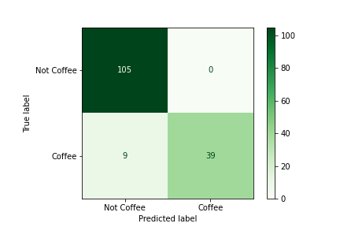
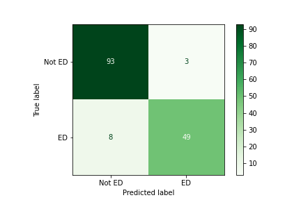
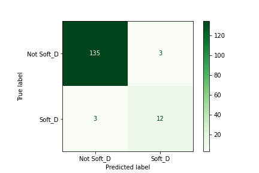
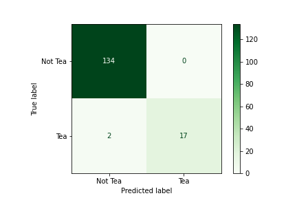
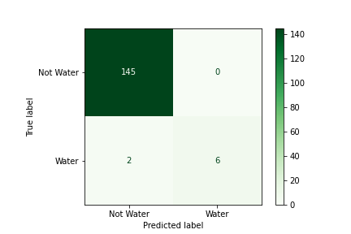

# Caffeine

## Description:

This project was a basic analysis of a data set. The data set can be found here: https://www.kaggle.com/datasets/heitornunes/caffeine-content-of-drinks. This data compares different drinks and their caffeine content. It's columns are drink (which is the drinks name), Volume (ml), Calories, Caffiene (mg), and drink type. The drink types are coffee, energy drinks, energy shots, soft drinks, tea, and water. There were no null entries in the data.

My goal for this project is to make models to see if the algorithm can predict what type of drinks it is, based on a few key details given to us by the data set.

## EDA:

This is a knn graph. It is comparing Volume (ml) with Caffiene (mg). The different colors represent the different type of drinks. Here is a key:

Brown = Coffee
Red = Energy Drinks
Purple = Energy Shots
Yellow = Soft Drinks
Light Green = Tea
Aqua = Water

It seems that there may be some correlation between caffeine content and weather the drink is coffee or not. This is further shown here in the heatmap:

We see a strong negative correlation between energy shots and volume which is understandable. We also see that Coffee is most highly correlated with high caffeine count.

## Modelling and analysis:

The first model I wanted to make is a logistic regression model that can determine if a drink is coffee or not based on Volume (ml), Calories, and Caffiene (mg). Before doing this though we need a baseline. The baseline is if we just guessed the same answer for every drink what percent of the time would we be correct. Our model needs to be better than that. 

In our case the baseline is 71.6% as 29.4% of the drinks are a type of coffee.

After running our model we get this R2 score:

Training R2: 0.7352297592997812
Testing R2: 0.738562091503268

While this model is neither overfit or underfit, it's only marginally better than the baseline. But let's observe it in a confussion matrix:

Looking at this confusion matrix, we see that it can guess not coffee better than it can guess coffee.

Looking at the names of the drinks, we see that the word coffee appears a lot in coffee drinks. Perhaps we can find a better model as a classification model that looks at the names of the drinks. I will do this for every drink type and show their R2 score:

Coffee:

Train: 0.986870897155361
Test: 0.9411764705882353

Energy Drinks:

Train: 0.9715536105032823
Test: 0.9281045751633987

Energy Shots:

Train: 1.0
Test: 0.9803921568627451

Soft Drinks:

Train: 0.9781181619256017
Test: 0.9607843137254902

Tea:

Train: 0.9934354485776805
Test: 0.9869281045751634

Water:

Train: 1.0
Test: 0.9869281045751634

All of these models are good

## Conclusion:

While it is difficult to tell what type of drink it is based on volume, calories, and caffiene content, we can based on the label. What this tells us is 2 things:

1. Companies label their products properly
2. All categories of drinks that boost you up have similar specs. So choose the drink that fits you best!

